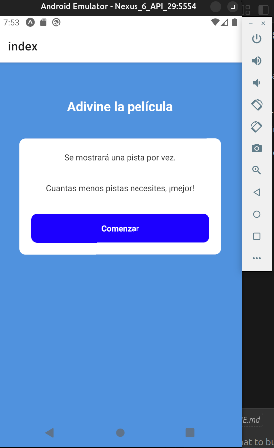
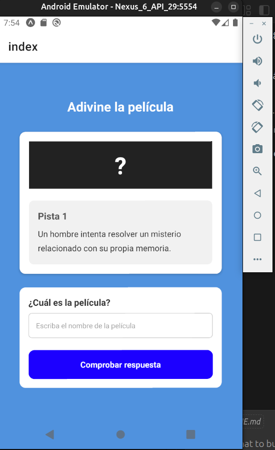
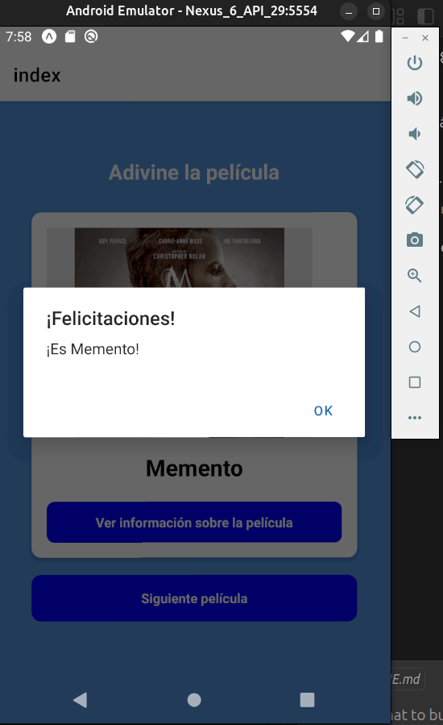
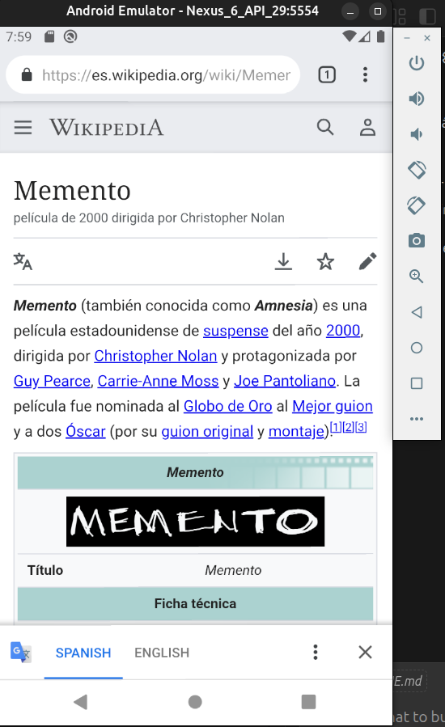
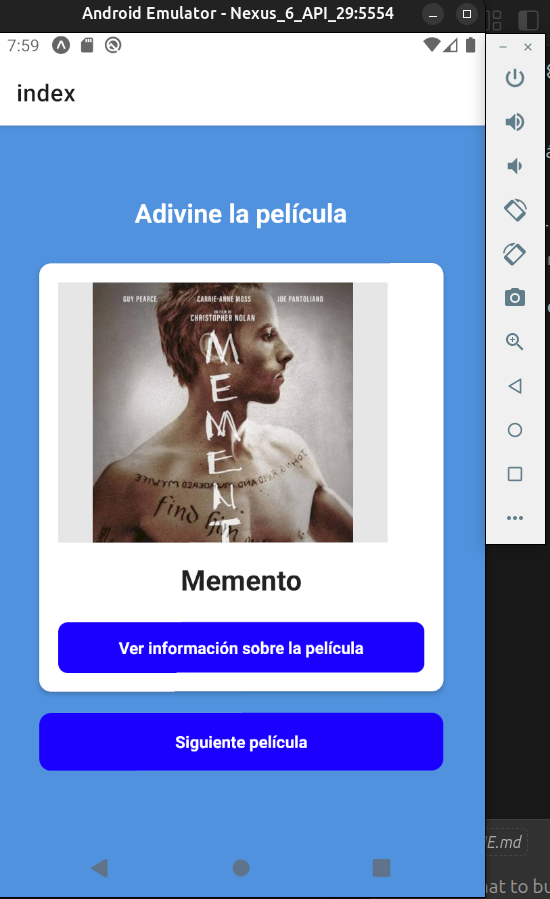

# Explicación de la aplicación de práctica 👋

# nombre: clase2

# propuesta: Adivine la película.

# Alumno: Santillán Marcelo

# Curso React Native 2026

# Introducción:

Hice una pequeña aplicación que utiliza datos de la carpeta src/data/mock index.ts
Estoy intentando también adaptarme a usar typescript, este archivo ts es algo nuevo para mi.

# idea de la propuesta: Adivine la película.

Tengo en data 3 películas, se explica en la primera pantalla la idea del juego al usuario.



Por cada película hay tres pistas con orden de ayuda de menor a mayor.



Si el usuario adivina la peli, se muestra la imagen y se habilita
un enlace para ver mayor informaición de la pelicula.



Se abre en wikipedia más info de la pelicula.


El usuario puede elegir adivinar otra película.
Si se equivoca se pasa directamente a una película nueva.
Asimismo se van ofreciendo en forma aleatoria sin repetir.



Aclaración: En un smarthphone Android se ve mejor que en el emulador,
también hice que pueda rotar, solo para experimentar.

# que estuve usando en el desarrollo:

- `useState` para manejar estados del juego: película actual, pista, respuesta, acierto y películas usadas.
- TypeScript con interfaces para tipar la estructura de cada película (`id`, `pistas`, `titulo`, `imagen`, `enlace`).
- Arreglos y métodos como `filter`, `includes` y spread (`...`) para evitar repetir películas y reiniciar ciclo.
- JavaScript para lógica aleatoria con `Math.random()` y `Math.floor()` al elegir la siguiente película.
- Funciones de comparación y normalización de texto (`trim`, `toLowerCase`, `normalize`) para validar respuestas del usuario.

This is an [Expo](https://expo.dev) project created with [`create-expo-app`](https://www.npmjs.com/package/create-expo-app).

## Get started

###################

1. Install dependencies

   ```bash
   npm install
   ```

2. Start the app

   ```bash
   npx expo start
   ```

In the output, you'll find options to open the app in a

- [development build](https://docs.expo.dev/develop/development-builds/introduction/)
- [Android emulator](https://docs.expo.dev/workflow/android-studio-emulator/)
- [iOS simulator](https://docs.expo.dev/workflow/ios-simulator/)
- [Expo Go](https://expo.dev/go), a limited sandbox for trying out app development with Expo

You can start developing by editing the files inside the **app** directory. This project uses [file-based routing](https://docs.expo.dev/router/introduction).

## Get a fresh project

When you're ready, run:

```bash
npm run reset-project
```

This command will move the starter code to the **app-example** directory and create a blank **app** directory where you can start developing.

### Other setup steps

- To set up ESLint for linting, run `npx expo lint`, or follow our guide on ["Using ESLint and Prettier"](https://docs.expo.dev/guides/using-eslint/)
- If you'd like to set up unit testing, follow our guide on ["Unit Testing with Jest"](https://docs.expo.dev/develop/unit-testing/)
- Learn more about the TypeScript setup in this template in our guide on ["Using TypeScript"](https://docs.expo.dev/guides/typescript/)

## Learn more

To learn more about developing your project with Expo, look at the following resources:

- [Expo documentation](https://docs.expo.dev/): Learn fundamentals, or go into advanced topics with our [guides](https://docs.expo.dev/guides).
- [Learn Expo tutorial](https://docs.expo.dev/tutorial/introduction/): Follow a step-by-step tutorial where you'll create a project that runs on Android, iOS, and the web.

## Join the community

Join our community of developers creating universal apps.

- [Expo on GitHub](https://github.com/expo/expo): View our open source platform and contribute.
- [Discord community](https://chat.expo.dev): Chat with Expo users and ask questions.
