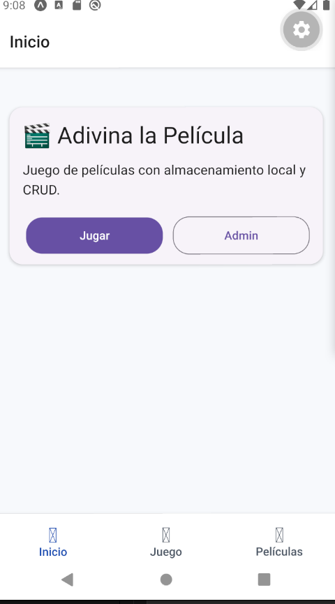
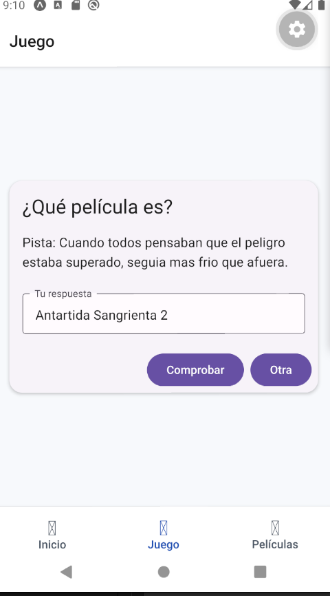
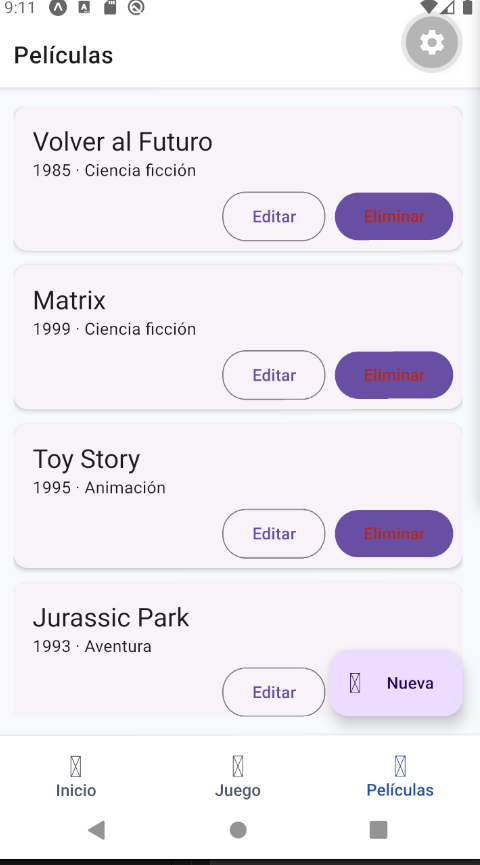
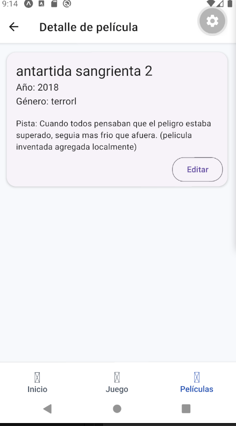
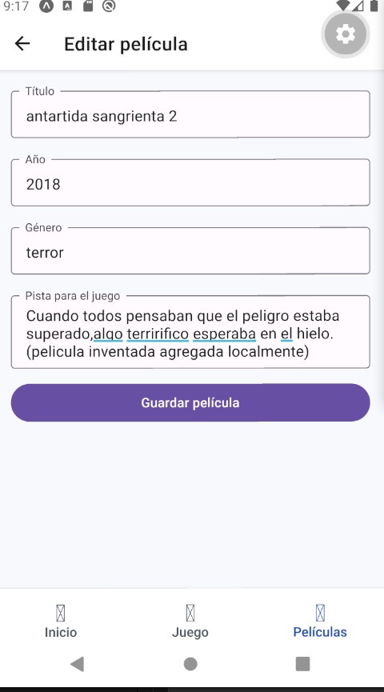

# Adivina La Pelicula - Navegacion y Material Design

Proyecto practico adaptado a la Actividad 2 (Navegacion en React Native), utilizando TypeScript.

## Objetivo cumplido

- Navegacion principal con Bottom Tabs.
- Navegacion anidada con Stack dentro de la pestana Peliculas.
- Paso de parametros con `navigation.navigate(..., params)` y `route.params`.
- Tipado de rutas y parametros en TypeScript para evitar errores.
- Componentes de React Native Paper para seguir Material Design 3.
- Persistencia local con AsyncStorage para CRUD y juego.

## Arquitectura de navegacion

- `TabNavigator` es el menu principal con 3 pestanas: Inicio, Juego y Peliculas.
- `PeliculasStackNavigator` vive dentro de la pestana Peliculas.
- En ese stack se resuelve el flujo lineal: Lista -> Detalle -> Formulario.

## Estructura principal

```text
src/
├── components/
│   └── PeliculaCard.tsx
├── data/
│   └── peliculasIniciales.ts
├── navigation/
│   ├── AppNavigator.tsx
│   ├── PeliculasStackNavigator.tsx
│   └── TabNavigator.tsx
├── screens/
│   ├── HomeScreen.tsx
│   ├── JuegoScreen.tsx
│   ├── PeliculasScreen.tsx
│   ├── PeliculaDetalleScreen.tsx
│   └── PeliculaFormScreen.tsx
├── storage/
│   └── peliculaStorage.ts
├── styles/
│   └── sharedStyles.ts
└── types/
    ├── navigation.ts
    └── pelicula.ts
```

## Comandos

Ejecutar desde la carpeta del proyecto `adivinapeli`.

```bash
npm install
npx expo start
```

Atajos utiles:

```bash
npm run android
npm run web
```

Chequeo de tipos:

```bash
npx tsc --noEmit
```

## Evidencias de entrega

Se agran
capturas en `assets/evidencias/`:

- Inicio: 
- Juego: 
- Lista de peliculas:
- Detalle de pelicula: 
- Formulario alta/edicion:

## Conceptos de clase usados

- `NavigationContainer`
- `createBottomTabNavigator`
- `createNativeStackNavigator`
- `navigation.navigate`
- `navigation.goBack`
- `route.params`
- `Card`, `Button`, `TextInput`, `FAB` de React Native Paper

## Estado actual y a futuro

Estoy intentando incorporar los conceptos de las clases,
practicando tratando de aplicarlos, con la ayuda de la ia para
transformarlo a typescript jajaja (ya lo voy aprender).
Y pronto voy a extender el tema de juegos pero a problemas
reales, estoy comenzando una investigación sobre apps
mobile para la tercera edad, y obviamente los smarthpones
son excelentes herramientas para aprovechar en terapias.

## Creditos

Alumno: Ing. Santillan Marcelo
Curso: React Native UTN - 2026
